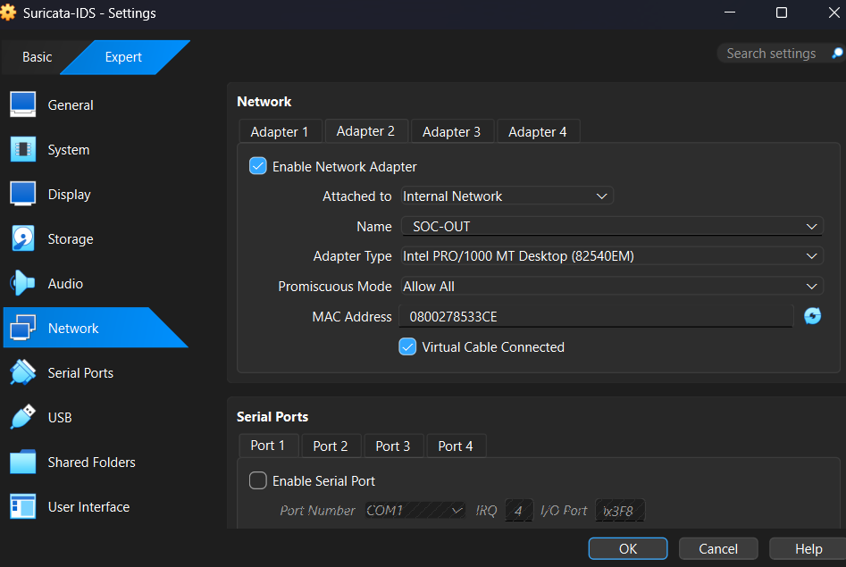

# Network Interfaces & Segmentation Design

This document describes the network topology, interface configuration, IP addressing model, and enforcement architecture used in the Suricata IDS Detection Lab.

The lab is intentionally segmented to simulate a realistic monitored environment where all inter-subnet traffic must traverse an inspection gateway before reaching its destination.

Attacker: 192.168.100.10  
Inspection Gateway: 192.168.100.1 / 192.168.200.1  
Target Server: 192.168.200.10  

---

## 1) Virtual Network Architecture Overview

The environment is built using VirtualBox Internal Networks to simulate subnet isolation.

Two isolated networks are created:

SOC-IN  → 192.168.100.0/24  
SOC-OUT → 192.168.200.0/24  

Suricata is deployed as a dual-homed gateway between these networks.

Logical traffic flow:

Kali (192.168.100.10)  
→ Suricata (Inspection Gateway)  
→ Ubuntu DVWA (192.168.200.10)

This ensures:
- No direct attacker-to-victim communication
- Mandatory routing through the IDS
- Full packet visibility at the gateway

---

## 2) VirtualBox Adapter Configuration

Suricata is configured with two internal adapters.

### Adapter 1 – SOC-IN

Configuration:
- Attached to: Internal Network
- Network Name: SOC-IN
- Promiscuous Mode: Allow All
- Adapter Type: Intel PRO/1000 MT Desktop

Purpose:
Handles ingress traffic from the attacker subnet.

---

### Adapter 2 – SOC-OUT

Configuration:
- Attached to: Internal Network
- Network Name: SOC-OUT
- Promiscuous Mode: Allow All
- Adapter Type: Intel PRO/1000 MT Desktop

Purpose:
Handles egress traffic toward the victim subnet.

---

## 3) Interface State Validation

After booting the Suricata VM, interface status was validated.

Command:
ip -br a

Confirmed:

- enp0s3 → 192.168.100.1/24
- enp0s8 → 192.168.200.1/24
- Both interfaces UP
- MTU 1500
- Proper subnet assignment

This verifies correct IP allocation and dual-homed configuration.

---

## 4) IP Addressing Plan

### Kali Linux (Attacker)

Network: SOC-IN  
IP Address: 192.168.100.10/24  
Default Gateway: 192.168.100.1  

Role:
- Generates reconnaissance traffic
- Launches SQL injection and XSS payloads
- Produces ICMP and TCP scans

---

### Suricata IDS (Gateway)

Interface enp0s3:
- 192.168.100.1/24 (SOC-IN)

Interface enp0s8:
- 192.168.200.1/24 (SOC-OUT)

Role:
- Acts as default gateway for both networks
- Routes traffic between subnets
- Performs inline inspection in IDS mode

---

### Ubuntu DVWA (Victim Server)

Network: SOC-OUT  
IP Address: 192.168.200.10/24  
Default Gateway: 192.168.200.1  

Services:
- Apache Web Server
- DVWA Application
- HTTP (Port 80)

Purpose:
- Target for exploitation testing
- Validates application-layer detection

---

## 5) IP Forwarding Configuration

To enable routing between interfaces, IPv4 forwarding must be enabled.

Command:
sudo sysctl -w net.ipv4.ip_forward=1

Verification:
cat /proc/sys/net/ipv4/ip_forward

Expected output:
1

Without IP forwarding:
- Packets would not traverse between subnets
- Segmentation enforcement would fail
- IDS visibility would be incomplete

---

## 6) Suricata Configuration Validation

Before starting detection testing, configuration integrity was validated.

Command:
sudo suricata -T -c /etc/suricata/suricata.yaml

This confirms:
- YAML syntax valid
- Rules properly loaded
- No configuration errors

---

## 7) Suricata Runtime Engine Initialization

Upon starting Suricata, runtime threads and packet capture status were verified.

Key Observations:
- Two capture interfaces active
- Engine threads created
- Flow manager initialized
- Packet capture mode operational

This confirms Suricata is actively monitoring both network boundaries.

---

## 8) Traffic Enforcement Model

Because both Kali and DVWA use Suricata as their default gateway:

- Kali cannot directly reach 192.168.200.10
- All packets must traverse enp0s3 → routing engine → enp0s8
- Suricata inspects traffic at Layer 3, 4, and 7

Validation using tcpdump:

Monitor SOC-IN:
sudo tcpdump -i enp0s3

Monitor SOC-OUT:
sudo tcpdump -i enp0s8

Observed behavior:
- ICMP and HTTP packets appear on ingress interface
- Forwarded packets appear on egress interface
- Payload inspection occurs before server response

This confirms proper inline placement of the IDS.

---

## 9) Security Design Rationale

This architecture simulates:

- Segmented internal networks
- East-West traffic inspection
- SOC boundary monitoring
- Controlled attack simulation
- Deterministic detection validation

Design advantages:

- Full traffic visibility
- Clear trust boundary enforcement
- No bypass paths
- Realistic SOC-style deployment
- Reproducible results

---

## 10) Architecture Summary

The lab demonstrates:

- Dual-homed IDS deployment
- Enforced routing through inspection gateway
- Proper IP segmentation
- Validated packet forwarding
- Active multi-interface capture
- Controlled attacker-to-victim flow

This design guarantees that all attack simulations are inspected, logged, and reproducible within a structured detection environment.
