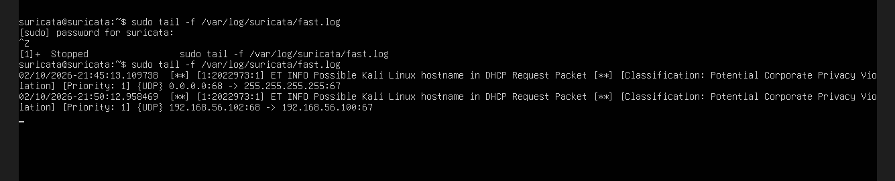

# Suricata Rule Engine & Custom Detection Engineering

This document details the rule architecture, ET Open integration, custom signature development, and runtime validation process used in the Suricata IDS Detection Lab.

All screenshots referenced here are located at:

evidence/screenshots/02_Rule_Engine_Validation/

---

# 1. Rule Engine Architecture

Suricata loads detection signatures from rule files defined in:

/etc/suricata/suricata.yaml

Primary rule sources in this lab:

- ET Open Community Ruleset (suricata.rules)
- Custom Local Rules (local.rules)

The rule engine compiles all signatures at startup and creates optimized detection structures for high-performance packet inspection.

Proof that local.rules is enabled in configuration:


This confirms:
- Custom rule file path is correctly defined
- Suricata includes it during rule parsing
- Detection engine will evaluate traffic against local signatures

---

# 2. ET Open Rule Base Integration

The Emerging Threats Open (ET Open) ruleset provides broad detection coverage including:

- Reconnaissance and port scanning
- Exploit attempts
- Malware indicators
- Web application attacks
- Protocol anomalies
- Suspicious user agents (e.g., Nmap)

Successful rule load verification:


Rule statistics validation:


This confirms:

- Tens of thousands of signatures compiled
- Zero rule parsing failures
- Detection engine initialized cleanly
- Application-layer inspection enabled

This mirrors real-world SOC deployments using community intelligence feeds.

---

# 3. Custom Detection Rules (local.rules)

Custom rules were created to:

- Provide deterministic lab validation
- Guarantee alert generation during testing
- Demonstrate signature-writing capability
- Validate payload inspection logic

Proof of custom rule contents:


Example custom rules implemented:

```
alert icmp any any -> any any (msg:"LAB TEST ALERT"; sid:1000001; rev:1;)

alert tcp any any -> 192.168.200.10 any (flags:S; msg:"SYN SCAN DETECTED"; sid:1000003; rev:1;)

alert tcp any any -> 192.168.200.10 80 (msg:"RAW SQLI UNION DETECTED"; content:"UNION"; nocase; sid:1002001; rev:1;)

alert tcp any any -> 192.168.200.10 80 (msg:"XSS ATTEMPT DETECTED"; content:"<script>"; nocase; sid:1003001; rev:1;)
```

Design considerations:

- Unique SID namespace (1000000+ reserved for lab)
- Directional detection (attacker → victim subnet)
- Payload inspection using content matching
- Case-insensitive matching for reliability
- Clear alert messages for fast.log visibility

This demonstrates practical detection engineering skills beyond default rule usage.

---

# 4. Detection Validation – fast.log

Suricata writes high-level alerts to:

/var/log/suricata/fast.log

Proof of alert triggering during attack simulation:


Observed detections include:

- ICMP test alerts
- SYN scan detection
- SQL injection payload detection
- XSS attempt detection

This confirms:

- Signatures are matched correctly
- Detection engine processes live traffic
- Logging pipeline is functional

---

# 5. Runtime Detection Evidence

During live attack simulation, Suricata generated alerts in real time.

Proof of runtime detection:



This validates:

- Active inspection of forwarded packets
- Detection threads operational
- Inline routing visibility across subnets

---

# 6. Reconnaissance Detection (Nmap)

ET Open includes signatures that detect:

- Nmap SYN scans
- Suspicious user agents
- TCP flag anomalies

Proof of Nmap detection in fast.log:


This demonstrates:

- Successful reconnaissance detection
- Integration of community intelligence rules
- Behavioral detection based on scanning patterns

---

# 7. Structured Alert Logging (eve.json)

Beyond fast.log, Suricata also generates structured JSON alerts in:

/var/log/suricata/eve.json

This provides:

- Source/destination IP visibility
- Flow identifiers
- HTTP metadata
- Full payload inspection context
- Timestamped forensic evidence

This structured format enables integration with:

- SIEM platforms
- Log pipelines
- Threat hunting workflows

---

# 8. Security Engineering Impact

This lab demonstrates real-world SOC capabilities:

✔ Rule integration from external intelligence feeds  
✔ Custom signature development  
✔ Deterministic validation of attack detection  
✔ Application-layer payload inspection  
✔ Multi-format logging verification  
✔ Runtime engine validation  

It reflects practical blue-team skills such as:

- Detection engineering
- Signature tuning
- Alert validation
- Traffic visibility analysis
- IDS performance verification

---

# 9. Conclusion

The rule engine in this lab is:

- Correctly configured
- Successfully loading ET Open rules
- Processing custom detection logic
- Generating real-time alerts
- Logging structured event data

Through controlled offensive testing (recon, SQLi, XSS), the system validates that:

All inter-subnet traffic is inspected, analyzed, and logged by Suricata in IDS mode.

This confirms a fully operational detection pipeline.
